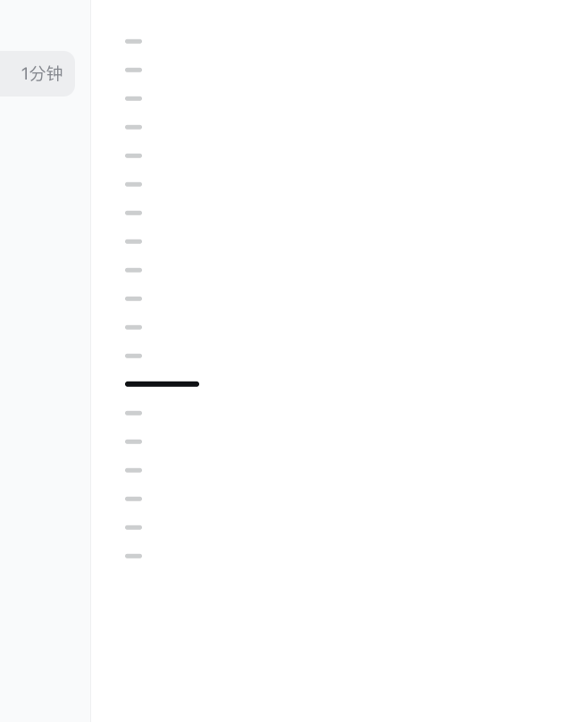

# DeepSeek Harness 消息导航器

为 DeepSeek Harness Web UI 提供 Codex 风格的会话消息导航器。

## 效果预览



*装上插件后的样子：对话右侧出现 Codex 式的消息导航器，悬停或点击即可浏览并跳转到任意一条用户消息。*

## 功能

- 只为普通用户消息和用户插话生成刻度；AI 回答、思考、工具和状态内容不计入。
- 每次用户发言只对应一条刻度，所有普通刻度等长，并以约 20px 的紧凑间距集中排布。
- 自动加载完整历史记录，不受 DeepSeek Harness 默认只渲染最新历史页的限制。
- 深色长刻度跟随当前阅读位置。
- 悬停或键盘聚焦时显示消息预览。
- 点击刻度或问题预览卡片均可平滑跳转；支持方向键、Home、End 和 Enter。
- 自动处理流式生成、新消息、加载较早记录、内容重排和会话切换。
- 少量刻度使用 Codex 式紧凑固定间距；超长会话才统一压缩间距。
- 使用 DeepSeek Harness 的 `--dsw-*` 主题变量，兼容深色模式和减少动画设置。
- 窄屏自动隐藏；全部逻辑在浏览器本地运行，不发送或持久化消息内容。

## 兼容范围

当前版本基于 npm 可安装的 DeepSeek Harness `0.1.0-rc.6`，并使用官方仓库 `rc.5` 至 `rc.6` 保持的公开 Web UI 合约：

- `[data-conversation-scroll]`
- `[data-chat-flow]`
- `[data-chat-anchor-key]`
- `[data-chat-flow-kind]`
- `shell.overlay` 插槽

DeepSeek Harness 仍处于 Developer Preview。如果上游修改这些合约，需要同步升级本插件。

`rc.6` 的客户端模块扫描器还不能从 profile 的独立依赖解析基点稳定发现第三方 `dsh.client` 包。本插件的 Host 入口通过官方 `webServer.register()` 和 `tapIndex()` 提供兼容桥；未来 Harness 原生发现外部客户端包时，启动图中的重复检测会自动让桥保持幂等。

## 桌面版兼容性

本插件是 DSH Web UI 扩展，已验证目标是 `web` profile。对于继续启动或嵌入官方 DSH Web UI，并保持同一套 profile、session runtime、plugin loader 和 client loader 的桌面版，预期可以使用。

已核对的社区桌面项目中，以下架构与本插件兼容方向一致：

- [`anywhere-labs/deepseek-harness-desktop`](https://github.com/anywhere-labs/deepseek-harness-desktop)：项目文档说明 Desktop 不是重写 Harness，而是把同一个运行时放进桌面应用；用户仍使用官方 DSH 的 profile、plugins、sessions 和 Web UI。`upstream.json` 标注 `sourceVersion` 为 `0.1.0-rc.5`，`runtimePackageVersion` 为 `0.1.0-rc.6`，与本插件的目标版本一致。
- [`hairyf/deepseek-harness-desktop`](https://github.com/hairyf/deepseek-harness-desktop)：README 描述为 Tauri WebView，启动 `dsh --profile web --host 127.0.0.1 --port 3080`，再嵌入 `http://127.0.0.1:3080/`。
- [`vibeinging/deepseek-harness-desktop-app`](https://github.com/vibeinging/deepseek-harness-desktop-app)：README 描述为启动 DSH Web Profile，并继续使用同一套 Session、Agent、Tool、Skill、MCP、Settings、Profile Bundle 和 Client Loader。
- [`dataelement/dsh-desktop`](https://github.com/dataelement/dsh-desktop)：README 描述为打包本地 DeepSeek Harness Web experience，并持久化 profiles、plugins 和 sessions。

不保证兼容的情况：桌面版重写了消息渲染器、未使用 `web` profile、禁用前端插件注入，或绑定了与本插件依赖不兼容的 DSH Web UI 内部版本。

如果桌面版使用自己的 `DSH_HOME`，需要把插件安装到该桌面版实际使用的 profile 中，而不是系统默认的 `~/.dsh`。多数桌面版仍使用 `web` profile，但数据目录可能是应用私有目录。

## 给安装 Agent 的提示

如果你是 AI Agent、脚本助手或正在替用户安装本插件，请遵守以下规则：

- 先确认用户使用的是 DSH Web 还是某个 DSH Desktop App。
- 先确认实际 profile 名称，默认优先检查 `web`，不要盲目安装到其他 profile。
- 如果用户使用桌面版，先确认该桌面版是否使用应用私有 `DSH_HOME`。如果是，请把插件安装到桌面版实际使用的数据目录/profile，而不是默认 `~/.dsh`。
- 不要删除、重建或覆盖用户已有 profile。安装时保留其他插件、`pnpm-workspace.yaml`、`allowBuilds` 和现有配置。
- 不要在未获得用户同意时启动、退出或重启 DSH / DSH Desktop。安装后只报告验证结果，让用户自行重启。
- 安装后必须验证插件是否出现在目标 profile 的依赖树中。

推荐的验证命令：

```sh
dsh plugin --profile web add ./dsh-message-navigator-0.1.3.tgz
cd ~/.dsh/profiles/web
pnpm ls dsh-message-navigator --depth 0
```

如果桌面版使用自定义 `DSH_HOME`，请在对应 profile 目录执行最后一条验证命令。

## 从源码检查与打包

要求 Node.js 22+ 和 pnpm。

```sh
pnpm install
pnpm check
pnpm pack
```

`pnpm check` 会依次执行 TypeScript 检查、单元测试和客户端插件构建。构建生成：

```text
lib/index.js   # Harness host 入口
lib/client.js  # 浏览器插件，包含 ModuleLoader 注册包装
```

## 安装

推荐先打包为 tarball，避免 git 依赖的安装期构建授权：

```sh
dsh plugin --profile web add ./dsh-message-navigator-0.1.3.tgz
dsh --profile web --dump-config
dsh --profile web
```

如果使用其他 profile，请把 `web` 替换成对应名称。卸载：

```sh
dsh plugin --profile web remove dsh-message-navigator
```

如果此前只使用不带 profile 的 `dsh web` 快捷命令，需要先创建一个可扩展的 Web profile：

```sh
dsh plugin --profile web add @deepseek-ai/dsh-web-app@next
dsh plugin --profile web add ./dsh-message-navigator-0.1.3.tgz
dsh --profile web
```

pnpm 首次安装 Web profile 时可能要求允许 `koffi` 的官方原生构建脚本。按照 dsh 输出，在该 profile 的 `pnpm-workspace.yaml` 中将对应 `allowBuilds.koffi` 设置为 `true` 后重试。

## 本地源码安装

```sh
dsh plugin --profile web add /absolute/path/to/deepseek-message-navigator
```

源码安装会执行 `prepare`。pnpm 10 可能要求在 profile 的 `pnpm-workspace.yaml` 中允许该包构建：

```yaml
allowBuilds:
  dsh-message-navigator: true
```

允许后重新执行安装命令。

## 隐私与可访问性

预览只读取当前 DeepSeek Harness 页面已经渲染的文本，不读取模型请求、隐藏提示词或服务端日志。插件不包含网络请求、遥测或本地存储。所有刻度都是可聚焦按钮，并提供中文无障碍标签。

## 项目结构

```text
src/core.ts                       位置、激活消息与文本纯函数
src/client/MessageNavigator.tsx   DOM 适配与完整交互
src/client/index.tsx              shell.overlay 注册入口
src/index.ts                      Host 入口
test/core.test.ts                 纯函数单元测试
cordis.patch.yml                  Profile 安装层
```

## License

MIT
